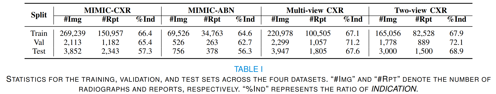

# MCL
MCL: Multi-view Enhanced Contrastive Learning for Chest X-ray Report Generation

Radiology reports are crucial for planning treatment strategies and enhancing doctor-patient communication, yet manually writing these reports is burdensome for radiologists. While automatic report generation offers a solution, existing methods often rely on single-view radiographs, limiting diagnostic accuracy. To address this problem, we propose MCL, a **M**ulti-view enhanced **C**ontrastive **L**earning method for chest X-ray report generation. Specifically, we first introduce multi-view enhanced contrastive learning for visual representation by maximizing the agreement between multi-view radiographs and their corresponding report. Subsequently, to fully exploit patient-specific indications (e.g., patient's symptoms) for report generation, we add a transitional ``bridge" for missing indications to reduce embedding space discrepancies caused by their presence or absence. Additionally, we construct Multi-view CXR and Two-view CXR datasets from public sources to support research on multi-view report generation. Our proposed MCL surpasses recent state-of-the-art methods across multiple datasets, achieving a 5.0\%  F\textsubscript{1} RadGraph improvement on MIMIC-CXR, a 7.3\% BLEU-1 improvement on MIMIC-ABN, a 3.1\% BLEU-4 improvement on Multi-view CXR, and an 8.2\% F\textsubscript{1,mic-14} CheXbert improvement on Two-view CXR.

## Update
- The paper is coming soon.

## Multi-view CXR
Multi-view CXR aggregates studies with multiple views from both MIMIC-CXR [1] and IU X-ray ]2]. The dataset can be downloaded in [huggingface 🤗](https://huggingface.co/datasets/MK-runner/Multi-view-CXR).

## Two-view CXR
Two-view CXR is a variant of Multi-view CXR that includes only two views per study. The dataset can be downloaded in [huggingface 🤗](https://huggingface.co/datasets/MK-runner/Multi-view-CXR).

## Usage
    ```python
    # obtain all studies of Multi-view CXR
    import json
    path = 'multiview_cxr_annotation.json'
    multi_view_cxr_data = json.load(open(path))

    # obtain all studies of Two-view CXR
    ann_data = json.load(open(path))
    two_view_cxr_data = {}
    for key, value in ann_data.items():
       two_view_cxr_data[key] = []
       for item in ann_data:
            ## current image_num
            image_num = len(item['anchor_scan']['image_path']) + len(item['auxiliary_references']['image_path'])
            if image_num != 2:
                two_view_cxr_data[key].append(item)
      
    ```

## Statistics for the training, validation, and test sets across MIMIC-CXR, MIMIC-ABN, Multi-view CXR, and Two-view CXR.
<div align=center></div>


## Citations

If you use or extend our work, please cite our paper at commoning soon.

```


```

## Acknowledgement

- [R2Gen](https://github.com/zhjohnchan/R2Gen) Some codes are adapted based on R2Gen.
- [R2GenCMN](https://github.com/zhjohnchan/R2GenCMN) Some codes are adapted based on R2GenCMN.
- [MGCA](https://github.com/HKU-MedAI/MGCA) Some codes are adapted based on MGCA.

## References
[1] Johnson, Alistair EW, et al. "MIMIC-CXR-JPG, a large publicly available database of labeled chest radiographs." arXiv preprint arXiv:1901.07042 (2019).

[2] Demner-Fushman, Dina, et al. "Preparing a collection of radiology examinations for distribution and retrieval." Journal of the American Medical Informatics Association 23.2 (2016): 304-310.

[3] Ni, Jianmo, et al. "Learning Visual-Semantic Embeddings for Reporting Abnormal Findings on Chest X-rays." Findings of the Association for Computational Linguistics: EMNLP 2020. 2020.

[4] Chen, Zhihong, et al. "Generating Radiology Reports via Memory-driven Transformer." Proceedings of the 2020 Conference on Empirical Methods in Natural Language Processing (EMNLP). 2020.

[5] Chen, Zhihong, et al. "Cross-modal Memory Networks for Radiology Report Generation." Proceedings of the 59th Annual Meeting of the Association for Computational Linguistics and the 11th International Joint Conference on Natural Language Processing (Volume 1: Long Papers). 2021. 

[6] Wang, Fuying, et al. "Multi-granularity cross-modal alignment for generalized medical visual representation learning." Advances in Neural Information Processing Systems 35 (2022): 33536-33549.
