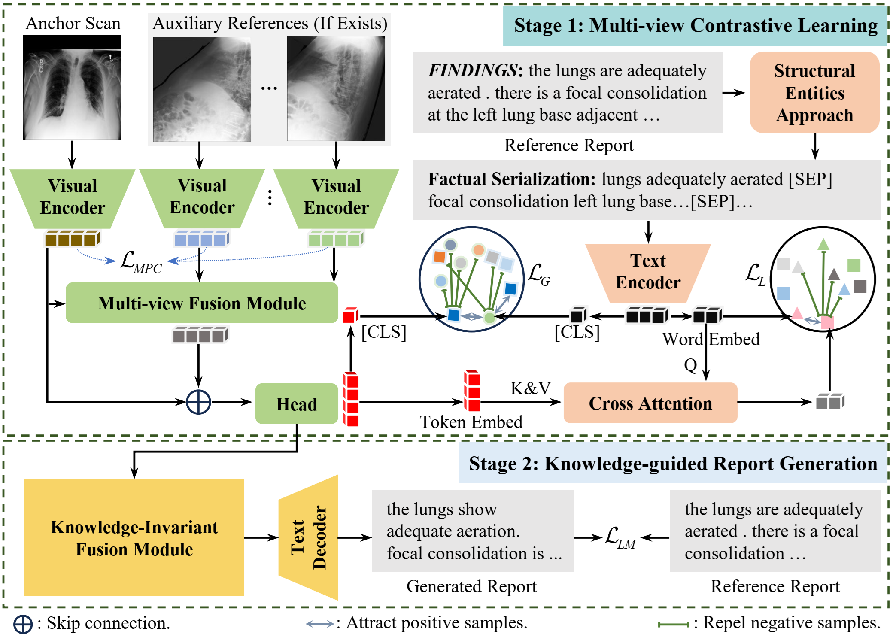

<div align="center">

# 🚀 EVOKE: Elevating Chest X-ray Report Generation via Multi-View Contrastive Learning and Patient-Specific Knowledge

[](https://arxiv.org/abs/2411.10224)
[](https://huggingface.co/datasets/MK-runner/Multi-view-CXR)
[](https://huggingface.co/datasets/MK-runner/Multi-view-CXR/tree/main/checkpoints)
[](https://github.com/mk-runner/EVOKE/tree/main/generated_reports/MIMIC-CXR)

<div align="center">
  
</div>

</div>

---
## 📅 Update
- 🛠 **2025-08-08:** **Code**, **checkpoints**, and **generated reports** are released.

---
## 📦 Checkpoints and Generated Reports

| Method        | Checkpoint                                                                                                                                | Generated Reports                                                                                                         |
| ------------- | ----------------------------------------------------------------------------------------------------------------------------------------- | ------------------------------------------------------------------------------------------------------------------------- |
| **EVOKE-224** | [HuggingFace](https://huggingface.co/datasets/MK-runner/Multi-view-CXR/blob/main/checkpoints/MIMIC-CXR/resolution-224x224/model_best.pth) | [GitHub](https://github.com/mk-runner/EVOKE/blob/main/generated_reports/MIMIC-CXR/resolution-224x224/test_prediction.csv) |
| **EVOKE-384** | [HuggingFace](https://huggingface.co/datasets/MK-runner/Multi-view-CXR/blob/main/checkpoints/MIMIC-CXR/resolution-384x384/model_best.pth) | [GitHub](https://github.com/mk-runner/EVOKE/blob/main/generated_reports/MIMIC-CXR/resolution-384x384/test_prediction.csv) |

---

## 📂 Datasets
### 🖼 Medical Images
| Dataset | Source | Notes |
|---------|--------|-------|
| **MIMIC-CXR**, **MIMIC-ABN** | [PhysioNet](https://physionet.org/content/mimic-cxr/2.0.0/) | Public, organized under `p10`-`p19` |
| **IU X-ray** | [NIH Open-i](https://openi.nlm.nih.gov/faq#collection) | Root dir: `NLMCXR_png` |
| **Multi-view CXR** | `NLMCXR_png` + MIMIC-CXR | Studies with multiple views |
| **Two-view CXR** | Subset of Multi-view CXR | Only two views per study |

The folder structure for all datasets is as follows:
```
files/
├── p10
    └── p10000032
            └── s50414267
               ├── 02aa804e-bde0afdd-112c0b34-7bc16630-4e384014.jpg
               └── 174413ec-4ec4c1f7-34ea26b7-c5f994f8-79ef1962.jpg
├── p11
├── p12
├── p13
├── p14
├── p15
├── p16
├── p17
├── p18
├── p19
└── NLMCXR_png
   ├── CXR1_1_IM-0001-3001.png
   ├── CXR1_1_IM-0001-4001.png
   └── CXR2_IM-0652-1001.png
```

### 📝 Raw Radiology Reports
- MIMIC-CXR & MIMIC-ABN: [PhysioNet](https://physionet.org/content/mimic-cxr/2.0.0/)  
- IU X-ray: [NIH Open-i](https://openi.nlm.nih.gov/faq#collection)

### 📝  Processed Reports
Raw reports have been reorganized for easier use. Processed **Multi-view CXR** and **Two-view CXR** datasets are available on
[🤗 HuggingFace](https://huggingface.co/datasets/MK-runner/Multi-view-CXR) (PhysioNet authorization required).

## 💻 Load Radiology Reports
    ```python
    # obtain all studies of Multi-view CXR
    import json
    path = 'multiview_cxr_annotation.json'
    multi_view_cxr_data = json.load(open(path))

    # obtain all studies of Two-view CXR
    ann_data = json.load(open(path))
    two_view_cxr_data = {}
    for key, value in ann_data.items():
       two_view_cxr_data[key] = []
       for item in ann_data:
            ## current image_num
            image_num = len(item['anchor_scan']['image_path']) + len(item['auxiliary_references']['image_path'])
            if image_num != 2:
                two_view_cxr_data[key].append(item)
      
    ```

## 📊 Dataset Statistics
<div align="center">  </div>

---

## 📊 Evaluation using generated radiology reports

```python
def compute_performance_using_generated_reports():
    from tools.metrics.metrics import compute_all_scores
    evoke_224 = 'generated-radiology-reports/MIMIC-CXR/test_reports_epoch-1_20-10-2024_16-28-28.csv'
    evoke_384 = 'generated-radiology-reports/MIMIC-ABN/test_reports_epoch-1_23-10-2024_10-25-20.csv'
    args = {
        'chexbert_checkpoint': "/home/miao/data/dataset/checkpoints/chexbert.pth",
        'chexbert_model_checkpoint': "/home/miao/data/dataset/checkpoints/bert-base-uncased",
        'chexbert_tokenizer_checkpoint': "/home/miao/data/dataset/checkpoints/bert-base-uncased",
        'radgraph_checkpoint': "/home/miao/data/dataset/checkpoints/radgraph",
    }
    for generated_path in [evoke_224, evoke_384]:
        data = pd.read_csv(generated_path)
        gts, gens = data['labels'].tolist(), data['report'].tolist()
        scores = compute_all_scores(gts, gens, args)
        print(scores)
```

---

## ⚙️ Requirements

- `torch==2.1.2+cu118`
- `transformers==4.23.1`
- `torchvision==0.16.2+cu118`
- `radgraph==0.09`

## 🚀 Training

### 1. Download Checkpoints for Model & Metrics
- For CE metrics calculation: `chexbert.pth`, `radgraph`, and `bert-base-uncased`.
- For model initialization: `resnet101` (image encoder), `microsoft/BiomedVLP-CXR-BERT-specialized` (text encoder), `distilbert/distilgpt2` (define text generator), and `cvt2distilgpt2` (initialize text generator).


| **Chekpoint Name**                    | **Config Variable Name** | **Download Link**                                                                          |
| :------------------------------- | :----------------- | :------------------------------------------------------------------------------------ |
| chexbert.pth                     | chexbert_checkpoint in `config/finetune_config.yaml`    | [StanfordMedicine](https://stanfordmedicine.app.box.com/s/c3stck6w6dol3h36grdc97xoydzxd7w9)       |
| bert-base-uncased                | chexbert_model_checkpoint, chexbert_tokenizer_checkpoint, and fusion_checkpoint in `config/finetune_config.yaml`         | [HuggingFace](https://huggingface.co/google-bert/bert-base-uncased)                   |
| radgraph                         | radgraph_checkpoint in `config/finetune_config.yaml`     | [PhysioNet](https://physionet.org/content/radgraph/1\.0.0/)                           |
| resnet101                        | resnet_checkpoint in `config/finetune_config.yaml`      | [HuggingFace](https://huggingface.co/allenai/scibertsscivocabuuncased)                |
| scibert_scivocab_uncased         | text_checkpoint in `config/finetune_config.yaml`      | [HuggingFace](https://huggingface.co/allenai/scibertsscivocabuuncased)                |


### 2. Run Training & Inference Stages
```bash

# Stage 1: Multi-view Contrastive Learning
bash run_cxr_pt_224.sh

# Stage 2: Knowledge-guided Report Generation
bash run_cxr_ft_224.sh

# Inference for report generation
bash run_cxr_test_224.sh
```
----

## 📚 Citation
If you use or extend this work, please cite:

```
@misc{miao2025evokeelevatingchestxray,
      title={EVOKE: Elevating Chest X-ray Report Generation via Multi-View Contrastive Learning and Patient-Specific Knowledge}, 
      author={Qiguang Miao and Kang Liu and Zhuoqi Ma and Yunan Li and Xiaolu Kang and Ruixuan Liu and Tianyi Liu and Kun Xie and Zhicheng Jiao},
      year={2025},
      eprint={2411.10224},
      archivePrefix={arXiv},
      primaryClass={cs.CV},
      url={https://arxiv.org/abs/2411.10224}, 
}
```
---
## 🙏 Acknowledgements

- [R2Gen](https://github.com/zhjohnchan/R2Gen) Some codes are adapted based on R2Gen.
- [R2GenCMN](https://github.com/zhjohnchan/R2GenCMN) Some codes are adapted based on R2GenCMN.
- [MGCA](https://github.com/HKU-MedAI/MGCA) Some codes are adapted based on MGCA.

---
## 🔗 References
[1] Johnson, Alistair EW, et al. "MIMIC-CXR-JPG, a large publicly available database of labeled chest radiographs." arXiv preprint arXiv:1901.07042 (2019).

[2] Demner-Fushman, Dina, et al. "Preparing a collection of radiology examinations for distribution and retrieval." Journal of the American Medical Informatics Association 23.2 (2016): 304-310.

[3] Ni, Jianmo, et al. "Learning Visual-Semantic Embeddings for Reporting Abnormal Findings on Chest X-rays." Findings of the Association for Computational Linguistics: EMNLP 2020. 2020.

[4] Chen, Zhihong, et al. "Generating Radiology Reports via Memory-driven Transformer." Proceedings of the 2020 Conference on Empirical Methods in Natural Language Processing (EMNLP). 2020.

[5] Chen, Zhihong, et al. "Cross-modal Memory Networks for Radiology Report Generation." Proceedings of the 59th Annual Meeting of the Association for Computational Linguistics and the 11th International Joint Conference on Natural Language Processing (Volume 1: Long Papers). 2021. 

[6] Wang, Fuying, et al. "Multi-granularity cross-modal alignment for generalized medical visual representation learning." Advances in Neural Information Processing Systems 35 (2022): 33536-33549.

---
